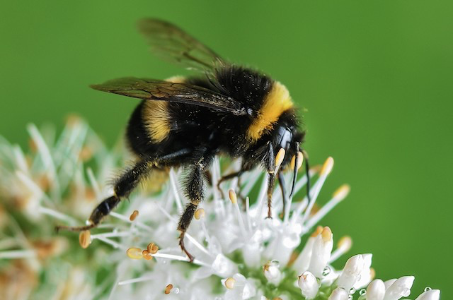
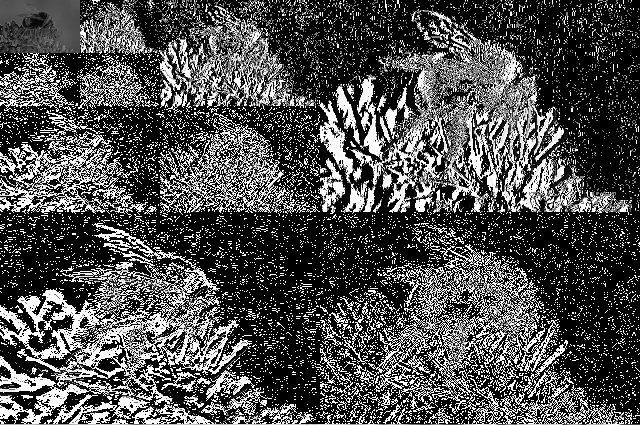

# HaarWaveletDecomposition


This is a simple but efficient implementation of multi-resolution Haar Wavelet decomposition. It can process single or three-channel colour images. The code performs both forward and backward transforms. The demo file can be tried using:

```
python demo.py
```

For a given input image, the output of the demo should be as shown in the second image. Please note the image mostly appears dark because the values are small and all negative values have been clipped to create an 8-bit image.

<p float="center">
  
   
</p>

