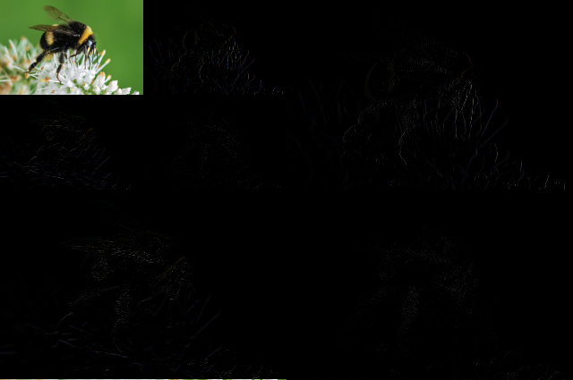

# HaarWaveletDecomposition

This is a simple but efficient implementation of multi-resolution Haar Wavelet decomposition. It can process single or three-channel colour images. The demo file can be tried using:

```
python demo.py
```

For a given input image, the output of the demo should be as shown in the second image:

<p float="center">
  
   
</p>


